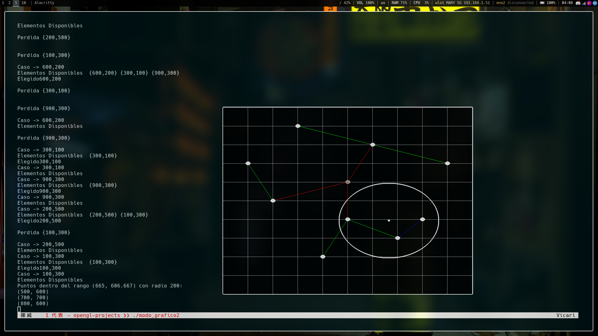

# Spatial Approximation Tree (SA-Tree) — Visual Demo & Range Search

This repository contains a minimal **C++/OpenGL** visualization and a toy implementation of a **Spatial Approximation Tree (SA-tree)** with a simple **range query** (click-to-search) over a 2D point set.

It’s intended as a **learning and demo tool** that ties the classic SA-tree / DSA-tree papers to a working, visual example.

> SA-trees _“approach”_ the query spatially instead of dividing the space.  
> They’re effective **metric indexes** especially when **selectivity is low** or the space is **hard to split**.  
> **Dynamic SA-trees (DSA-trees)** extend SA-trees with **insertions/deletions** and often improve search performance in practice.

---

## What this project shows

- A small **point set** (`{x, y}` pairs) rendered on a **1000×1000 grid**.
- A **tree** built from those points (**root + children edges**, color-coded by depth).
- **Range search**: left-click anywhere to draw a search circle (`r = 200`) and print to `stdout` the points found within that radius using a simple **cover-radius pruning**.
- A **compact, readable codebase** you can tweak to reproduce examples and ideas from the SA-tree / DSA-tree literature.

---

## Background: SA-tree & DSA-tree in two minutes

- **SA-tree (Spatial Approximation Tree):**  
  An index for **metric spaces** (any distance obeying triangle inequality).  
  Searching proceeds by **approaching the query** from selected representatives (nodes) and using **triangle inequality** to prune away regions.  
  SA-trees often give **sublinear search** (measured in distance evaluations) and perform well for **hard spaces / low selectivity queries**.

- **DSA-tree (Dynamic SA-tree):**  
  Supports **insertions** and **deletions** efficiently.  
  Surprisingly, in many cases **dynamic SA-trees are faster than static SA-trees** because incremental insertions lead to better-balanced structures.

---

## How the algorithm here works

This demo follows the **spirit** of SA-trees while keeping the code compact for visualization:

### 1. Root choice

- Currently hard-coded to the **4th point** (`rando = 3`), then removed from `S`.

### 2. Neighbor selection & children assignment

- For the active node `a`, the remaining points are **sorted by distance to `a`**.
- A list `N_a` of **neighbors** is built greedily:
  - a candidate `v` becomes a neighbor unless it’s **closer to an already chosen neighbor** than to `a`.
- Points not absorbed by any neighbor are attached as **children** of the closest node in `N_a`  
  _(in the current code: “closest to `a`” heuristic)_.

### 3. Covering radius

- `a->R` is updated as the **max distance** from `a` to any point considered at this stage—used for **pruning**.

### 4. Recursive construction

- For each `b ∈ N_a`, we form a subset `S_b = { v : d(v, b) < d(v, a) }` and recurse, linking `b` as a child of `a`.

### 5. Range search

- DFS from the root:
  - A node is **reported** if `d(node, q) ≤ r`.
  - A child subtree is **explored** if `d(child, q) ≤ r + child->R`.
- This is a standard **triangle-inequality pruning** idea in metric indexes.

---

## Interesting stuff (tips, gotchas, and lesser-known insights)

- **They’re “approach-based,” not partition-based.**  
  SA-trees **walk toward the query** using triangle inequality to prune, often beating partition structures when the space is **tough** or queries are **broad**.  
  → This is why they can be **best-in-class on “hard” datasets**.

- **When _not_ to use it:**
  - If you have **low-dimensional Euclidean data** with rectangles (e.g., GIS), an **R-tree** variant may be simpler.
  - If you need **billion-scale vector ANN** with strict latency (e.g., recommender systems), specialized ANN methods (**HNSW**, **IVF**, etc.) will dominate.
  - SA/DSA shines in **general metric settings** where ANN assumptions don’t hold.

---

## 📸 Screenshots

| Example: Range Search                                                         |
| ----------------------------------------------------------------------------- |
|  |

| Example: Paper Reproduction                                                               |
| ----------------------------------------------------------------------------------------- |
|  |

## Run Code

```bash
sudo apt-get update
sudo apt-get install -y g++ cmake libglfw3-dev freeglut3-dev libglu1-mesa-dev
g++ -O2 -std=c++17 main.cpp -lglfw -lGL -lglut -lGLU -lm -o sa-tree
./sa-tree
```

```bash
sudo dnf install freeglut freeglut-devel glfw glfw-devel mesa-libGLU-devel
g++ main.cpp -o sa-tree -lGL -lGLU -lglut -lglfw -lm
./sa-tree
```

## Further reading

If you want to dive deeper, check out the papers included in the `/papers` folder:

- Navarro, _Searching in metric spaces by spatial approximation_ (SA-tree, VLDBJ 2002).
- Navarro & Reyes, _Dynamic Spatial Approximation Trees_ (DSA-tree, ACM JEA 2008).
- Navarro & Reyes, _Improved Deletions in Dynamic SA-trees_ (2003).
- Navarro & Reyes, _Dynamic SA-trees for Massive Data_ (disk-based dsa\*/dsa+, SISAP 2009).
- Barroso et al., _Enlarging Nodes to Improve DSA-trees_ (clustering, SISAP 2010).
- Peñarrieta et al., _Distributed SAT (SAT\*)_ (root selection, CLEI 2006).

```

```
